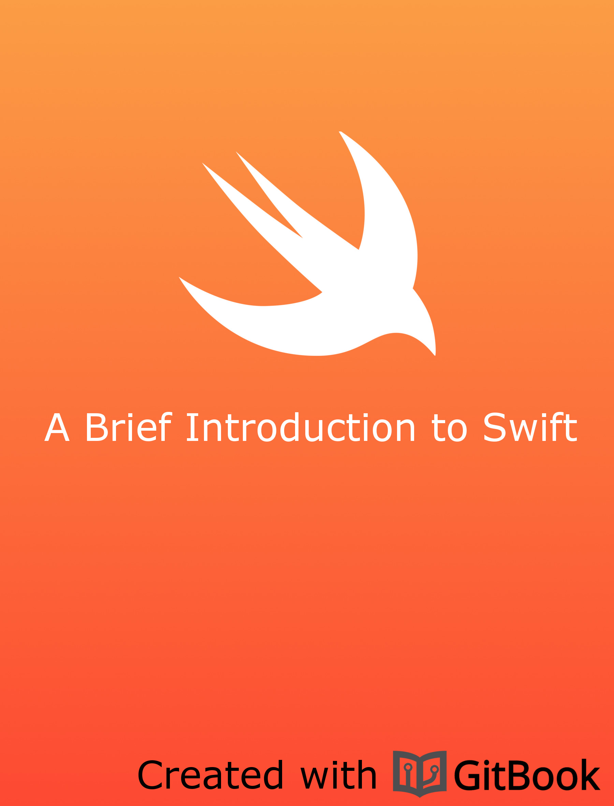

[Swift Cheat Sheet Repo](http://zawiki.praxis-arbor.ch/doku.php/tschinz:swift)
================================

---

This is a attempt to create a small easy-to-understand as well as easy-to-use cheat sheet for Swift. Swift is the new programming language of Apple used in all of their devices. 
It is:

- Safe. The most obvious way to write code should also behave in a safe manner. Undefined behavior is the enemy of safety, and developer mistakes should be caught before software is in production. Opting for safety sometimes means Swift will feel strict, but we believe that clarity saves time in the long run.
- Fast. Swift is intend as a replacement for C-based languages (C, C++, and Objective-C). As such, Swift must be comparable to those languages in performance for most tasks. Performance must also be predictable and consistent, not just fast in short bursts that require clean-up later. There are lots of languages with novel features — being fast is rare.
- Expressive. Swift benefits from decades of advancement in computer science to offer syntax that is a joy to use, with modern features developers expect. But Swift is never done. We will monitor language advancements and embrace what works, continually evolving to make Swift even better.

---

[Table of Content](summary.md)

Licensing
---
This document is under the [CC BY-NC-ND 3-0 License, Attribution-NonCommercial-NoDerivs 3.0 Unported](http://creativecommons.org/licenses/by-nc-nd/3.0/).

