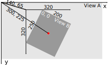

# Views
Views is a `UIView` subclass and it represents a rectangular Area on the screen.
* a View can have on superview
* a View can have many subviews

`UIWindow` is the very top of the view hierarchy (it even includes the status bar). But normally you never interact with it.

**Top View**
is a property of the Program called:
```swift
var view: UIView
```

## Initializing UIView
```swift
init(frame: CGRect)  // init of UIView created in code
init(coder: NSCoder) // init of UIView comes out of storyboard
```

If you need an initializer set them **both**
```swift
func setup() {...}

override init(frame:CGRect) {            // a designated init
    super.init(frame: frame)
    setup()
}

required init(coder aDecoder: NsCoder) { // a required init
    super.init(coder: aDecoder)
    setup()
}
```
## View's Coordinate System
* Origin = upper left
* Units are points (not pixels)
* One point can have multiple pixels
```swift
var contentSacleFactor: CGFloat // get number of pixels per point
```

* Boundaries is where drawings happen
```swift
var bounds: CGRect // a vies internal drawing space's origin and size
```
* The UIView location
```swift
var center: CGPoint // center of a UIView in its superview's coordinate system
var frame : CGRect  // the rect containing a UIview in its superview's coordinate system
```
* Bounds vs Frame


```swift
View B's bounds = ( (0  ,0) , (250,200) )
View B's frame  = ( (140,65), (320,320) )
View B's center = ( 300,225 )
View B's middle = (bounds.midX, bounds.midY) = (100,125)
```

## Creating a View
**In Stroyboard**
* Drag UIView into storyboard
* User `Identity Inspector` to changes it's class to your sublcass

**In Code**
Assuming this code is in the UIViewController
```swift
let labelRect = CGRect(x: 20, y:20 , width: 100, height:50)
let label = UILabel(frame: labelRect) // UILabel is a sublcass of UIView
label.text = "Hello"
view.addSubview(label)
```

## View transparency
Layers are defined in th order they are in the subviews list
* First in the list are the lower layers
* Later in the list are on Top
* Transparency is not cheap

## Hide a view
A hidden view don't receive touch inputs or events and can draw nothing on screen
```swift
var hidden: Bool
```

## Custom View
Used when
* Draw some custom drawing on screen
* If touch events need to be handeled differently

To create just create a UIView subclass and override drawRect.
```swift
override func drawRect(regionThatNeedsToBeDrawn: CGRect)
```
* **Never** call drawRect, if a View needs to be redraw use:
```swift
setNeedsDisplay()
setNeedsDisplayinRect(regionThatNeedsToBeDrawn: CGRect)
```

## Drawing
### Drawing Text
Usually `UILabel` is used to put text on screen

To draw in `drawRect` use `NSAttributedString` or `NSMutableAttributedString`
```swift
// Immutable
let text = NSAttributedString("Hello")
text.drawAtPoint(aCGPoint)
let textSize: CGSize = text.size // space used for the string
// Mutable
let mutableText = NSMutableAttributedString("some String")

// Set Attributes
func setAttributes(attributes: Dictionary, range: NSRange)
func addAttributes(attributes: Dictionary, range: NSRange)

NSForegroundColorAttributeName : UIColor
NSStrokeWidthAttributeName: CGFloat
NSFontAttributeNAme : UIFont
```

### `UIBezierPath`
```swift
// Create
let path = UIBezierPath()
// Move, add line or arcs to the path
path.moveToPoint(CGPoint(80,50)) // assume screen is 160x250
path.addLineToPoint(CGPoint(140,150))
path.addLineToPoint(CGPoint(10,150))
// Close path to start point
path.closePath()
// Set attributes and stroke / fill
UIColor.greenColor().setFill() // method of UIColor
UIColor.redColor().setStroke() // method of UIColor
path.linewidth = 3.0           // property in UIBezierPath
path.fill()
path.stroke()
```

**Other shapes**
```swift
let roundRect = UIBezierPath(roundedRect: aCGRect, cornerRadius: aCGFloat)
let oval = UIBezierPath(ovelInRect: aCGRect)
// ... and others
```

**Clipping**
```swift
addClip()
```

**HitDetection**
For HitDetection a path must be closed
```swift
func containsPoint(CGPoint) -> Bool // tells whether a point is inside a path
```

## `UIColor``
```swift
// Colors can also b RGB, HSB or even a pattern (using UIImage)
let green = UIColor.greenColor()
// Background Color
var backgroundColor : UIView
// Colors can have alpha (transparency)
let transparentYellow = UIColor.yellowColor().colorwithAlphaComponent(0.5)
// 0.0 = fully transparent 1.0 = fully opaque
// Transparency must be enabled in the UIView
var opaque = false
// Entire UIView transparent
var alpha: CGFloat
```

## UIFont
```swift
class func preferredFontForTextStyle(UIFontTextStyle) -> UIFont

UIFontTextStyle.Headline
UIFontTextStyle.Body
UIFontTextStyle.Footnote
````
**System Font**

Not used for user content
```swift
class func systemFontOfSize(pointSize: CGFloat) -> UIFont
class func boldsystemFontOfSize(pointSize: CGFloat) -> UIFont
```

## Coordinate System
### Data Structures
```swift
// CGFloat never user double or float for coordinated
let cfg = CGFloat(aDouble)

// CFPoint = two CFFloats in x and y
var point = CGPointer(x: 37.0, y: 55.2)
point.y -= 30
point.x += 20.0

// CGSize = struct with two CGFloats in width and height
var size = CGSize(width: 100.0, height: 50.0)
size.width  += 42.5
size.height += 75

// CGRect = CGPoint and CGSize
struct CGRect {
    var origin: CGPoint
    var size  : CGSize
}
let rect = CGRect(origin: aCGPoint, size: aCGSize)
// Other CGRect properties and methods
var minx: CGFloat          // left edge
var midY: CGFloat          // midpoint vertically
intersects(CGRect) -> Bool // does CGRect intersect with otehr one?
intersect(CGRect)          // clip the CGRect to the intersection wit hthe other one
contains(CGPoint) -> Bool  // does CGRect contain the given CGPoint?
//.. and many more
```
