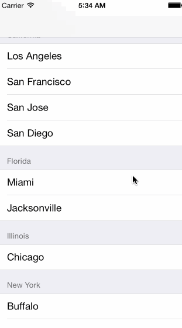

# UI Elements
## `UILabel`
Non editable text.

## `UITextField`
Like `UILabel`but editable. But attention, typing on an iPhone is secondary, the keyboard is too small. On an iPad it is already better.
The keyboard appears when `UITextField` becomes "first responder"
* Will be either automatically when the user taps
* Or you can do this manually by sending `becomeFirstResponder` message
* To make the keyboard go away, send `resignFirstResponder` to the UITextField

Delegate can get involved with Return Key
```swift
func textFieldShouldReturn(sender: UITextField) // sent when Return key is pressed
// Often times you will `sender.resignFirstResponder` in this method
```
Returns whether to do a normal processing when Return key is pressed (e.g. target/action).

### `Keyboard`
Controlling the appearance of the keyboard
Set the properties in the `UITextInputTraits` protocol (which `UITextField` implements).
```swift
var UITextAutocapitalizatinoType autocapitalizationType // words, sentences etc.
var UITextAutocorrectionType autocorrectionType // yes or no
var UIReturnKEyType returnKeyType //Go, Search, Google, Done etc.
var BOOL secureTextEntry // for passwords etc
var UIKeyboardType keyboardType // ASCII, URL, PhonePAd etc.
```

The keyboard comes always up **over** other views.
* You may need to adjust your UI for that. The TextField should always be visible. You can react to
```swift
UIKeyboard{Will,Did}{Show,Hide}Notifications // send to UIWindow
```
You can register a method to get called when a named "event" occures like this
#### Notifications
```swift
NSNotificationCenter.defaultCenter().addObserver(self,
                                   selector: "theKeyboardAppeared:",
                                   name: UIKeyboardDidShowNotification,
                                   object: view.window)
```
The Event here is UIKeyboardDidShowNotification. The object is the one who is causing the event to happen (our MVC's window). `func theKeyboardAppeared(notification: NSNotification)` will get called when it happens. The `notification.userInfo` will have details about the appearance.
`UITableViewController` listens for this & scrolls table automatically if a row has a UITextField.

### Other properties & functionality
```swift
// Propterty
var clearsOnBeginEditing: Bool
var adjustFontSizeToFitWidth: Bool
var minimumFontSize: CGFloat // always set this if you set adjustFontSizeToFitWidth
var placeholder: String // drown on gray when TextField is empty
var background/disableBackground: UIImage
var defaultTextAttributes: Dictionary // applies to entire Text

// Functionality
// UITextField have left and right overlays
// Keyboard have accessory views appearing above the keyboard
var inputAccessoryView: UIView // UITextField method
```


## `UITableView`
Very important class for displaying data in a table
 * One-dimensional table
 * Subclass of `UIScrollView`
 * Table can be static or dynamic
 * Lot of customization via a `dataSource` protocol and a `delegate` protocol
 * Very efficient even with very large sets of data

There are two styles of TableView's.
**Plain**
* Dynamic List


**Grouped**
* Static and Grouped


##### Multi-dimensional Tables
Usually done via a `UINavigationController` with multiple MVC's where View is `UITableView`.

